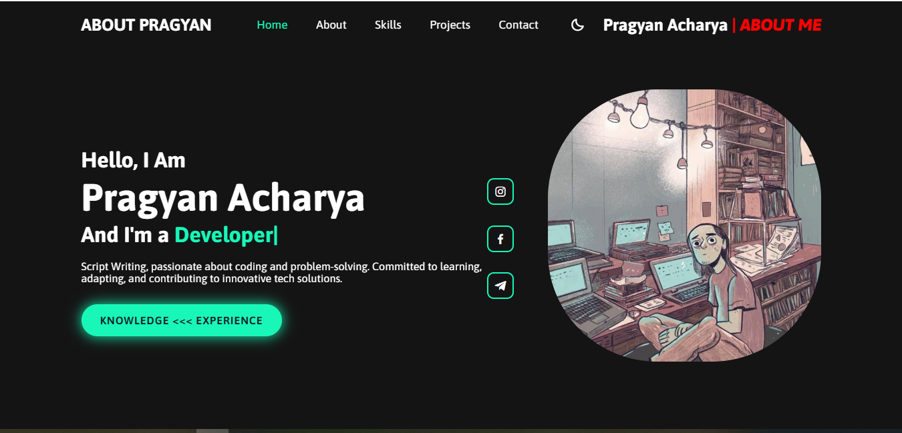

# 🌐 Personal Portfolio Website

Welcome to my Personal Portfolio Website repository!
This project represents my digital portfolio where I showcase my skills, projects, achievements, and contact information with a modern and responsive design.

---

# 🚀 Live Demo

🔗 **Portfolio Website:**
https://pragyanacharya.com

---

# ✨ Features

* 🎨 Modern & Attractive UI Design
* 🌙 Dark Mode Interface
* 📱 Fully Responsive Website
* ⚡ Smooth Scrolling & Animations
* 👨‍💻 About Me Section
* 🛠 Skills Showcase
* 📂 Project Gallery
* 📞 Contact Form
* 🔗 Social Media Integration
* 💡 Interactive Effects
* 🚀 Fast & Lightweight Performance

---

# 🛠 Tech-Stack

* HTML5
* CSS3
* JavaScript
* Responsive Design
* Animations & Effects

---

# 📂 Folder Structure

```text
My Portfolio/
│
├── index.html          # Main homepage
├── style.css           # Website styling
├── script.js           # JavaScript functionality
├── my.jpg              # Profile image
├── thankyou.html       # Thank You page
└── README.md           # Project documentation
```

---

# 📸 Website Preview

Add your website screenshot here.

```md
<h2 align="center">📸 Website Preview</h2>

<p align="center">
  
</p>
```

---

# ⚙️ Installation & Setup

## 1️⃣ Clone the Repository

```bash
git clone https://github.com/your-username/your-repository-name.git
```

## 2️⃣ Open the Project Folder

```bash
cd your-repository-name
```

## 3️⃣ Run the Website

Simply open:

```text
index.html
```

in your browser.

---

# 🤝 Contributing

Contributions are welcome!

If you'd like to contribute to this project:

## Steps to Contribute

1. Fork the repository

2. Create a new branch

```bash
git checkout -b feature-name
```

3. Commit your changes

```bash
git commit -m "Added new feature"
```

4. Push your branch

```bash
git push origin feature-name
```

5. Open a Pull Request

---

# 📄 License

This project is licensed under the MIT License.

You are free to use, modify, and distribute this project with proper credit.

---

# 📬 Contact

## GitHub

https://github.com/Pragyan-Acharya

## Email

[pragyanacharya607@gmail.com](mailto:pragyanacharya607@gmail.com)

---

# ❤️ Support

If you like this project, give it a ⭐ on GitHub!

---

# © Copyright

Copyright © 2024 by Pragyan <span>Acharya</span> | All Rights Reserved
